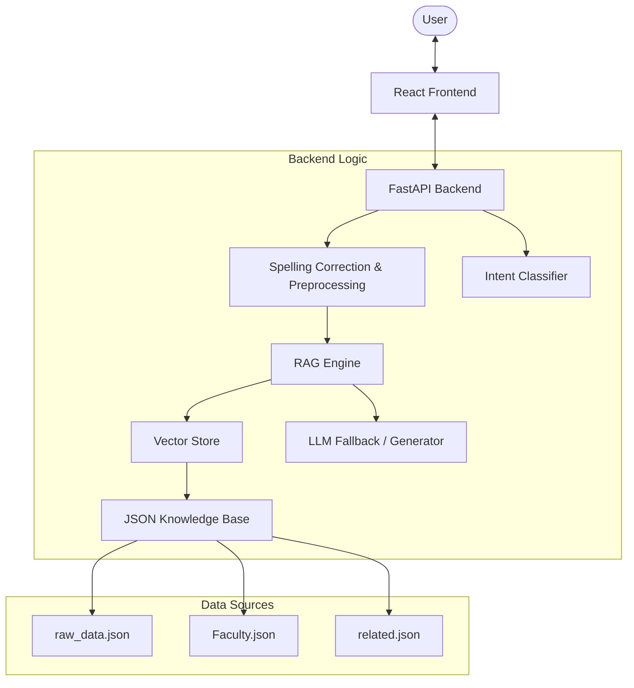

# AI PVGCOE & SSDIOM - AI-Powered College Enquiry Chatbot (RAG System)

This document provides a comprehensive overview of the **Intelligent College Enquiry Chatbot** developed for **Pune Vidyarthi Griha's College of Engineering & SS Dhamankar Institute of Management, Nashik**.

---

##  System Architecture

The project follows a modern **Client-Server Architecture** with a **Retrieval-Augmented Generation (RAG)** pipeline at its core.



---

##  Core Features

### 1. **Intelligent Query Handling (RAG)**
Unlike traditional chatbots that rely solely on hardcoded responses, this system uses a **Retrieval-Augmented Generation** approach:
- **Retrieval**: Searches a specialized vector store for the most relevant information about the college.
- **Augmentation**: Combines the retrieved context with the user's query.
- **Generation**: Uses an LLM (DialoGPT/Fallback) to generate a natural, conversational response based on the factual data.

### 2. **Voice Integration**
- **Speech-to-Text**: Users can talk to the chatbot directly using the Web Speech API.
- **Text-to-Speech**: The bot reads out responses, enhancing accessibility for all users.

### 3. **Hybrid Intent Classification**
- **ML Interpreter**: A TensorFlow-based model trained on college-specific queries.
- **Keyword Fallback**: A robust fallback system using keyword matching for common topics like admissions, faculty, and fees.

### 4. **Modern UI/UX**
- **React-powered**: Fast, responsive, and interactive interface.
- **Smart Suggestions**: Dynamically provides related questions based on the conversation context.
- **Professional Design**: Optimized for both mobile and desktop views with a clean, educational aesthetic.

---

##  Technical Stack

### **Backend (Python)**
- **Framework**: FastAPI (High-performance API)
- **ML/NLP**: 
  - `TensorFlow`: For intent classification models.
  - `Hugging Face Transformers`: DialoGPT-small for general conversational fallback.
  - `NLTK`: For natural language preprocessing.
  - `scikit-learn`: For vectorization and embeddings.
- **Database/Storage**: In-memory Vector Store for RAG components.
- **Utilities**: `autocorrect` for spelling fixes, `uvicorn` as the server.

### **Frontend (React)**
- **Framework**: React 18
- **Styling**: Tailwind CSS & Vanilla CSS
- **Icons**: FontAwesome 6
- **Voice**: Web Speech API integration

---

##  File Structure & Purpose

### **Root Directory**
- `setup.py`: Master script for environment setup and dependency installation.
- `start_backend.py`: Utility to boot up the FastAPI server.
- `PROJECT_DETAILS.md`: Automatically generated detailed code dump.

### **Backend (`/backend`)**
- `main.py`: Entry point for the FastAPI application.
- `llm_fallback.py`: Logic for interacting with LLM models when no direct match is found.
- `app/`:
    - `rag_knowledge_base.py`: Logic for parsing JSON data into text chunks for RAG.
    - `vector_store.py`: Implementation of the similarity search engine.
    - `spelling_fix.py`: Custom logic for correcting student typos.
- `data/`:
    - `raw_data.json`: The "Brain" of the bot containing college facts.
    - `Faculty.json`: Comprehensive data on faculty, departments, and vision/mission.
- `models/`: Pre-trained TensorFlow weights (`new_stem`).

### **Frontend (`/frontend`)**
- `src/components/`: Modular UI elements (Chat, Navbar, Hero section).
- `src/hooks/`: Custom React hooks for voice and API handling.
- `tailwind.config.js`: Custom styling tokens for the college branding.

---

## Launch Getting Started

### **1. Automated Setup**
Run the following at the root directory:
```bash
python setup.py
```

### **2. Running the Backend**
```bash
cd backend
python main.py
```
The API will be available at `http://localhost:8001`.

### **3. Running the Frontend**
```bash
cd frontend
npm install
npm start
```
The interface will be available at `http://localhost:3000`.

---

##  API Endpoints

| Endpoint | Method | Description |
| :--- | :---: | :--- |
| `/query/{text}` | GET | Prcoess a natural language query via RAG pipeline. |
| `/direct/{intent}` | GET | Get a direct response for a specific intent/tag. |
| `/health` | GET | System health check and checking if RAG is ready. |

---

##  Future Roadmap
1. **Multi-lingual Support**: Integration of Hindi and Marathi for local users.
2. **CMS Integration**: Real-time sync with the college's student management system.
3. **Analytics Dashboard**: Tracking the most frequently asked questions to improve data coverage.
4. **Enhanced LLM**: Scaling to larger models (Llama 3 / GPT-4) via API for even smarter responses.

---

*© 2026 Pune Vidyarthi Griha's College of Engineering & SS Dhamankar Institute of Management*
